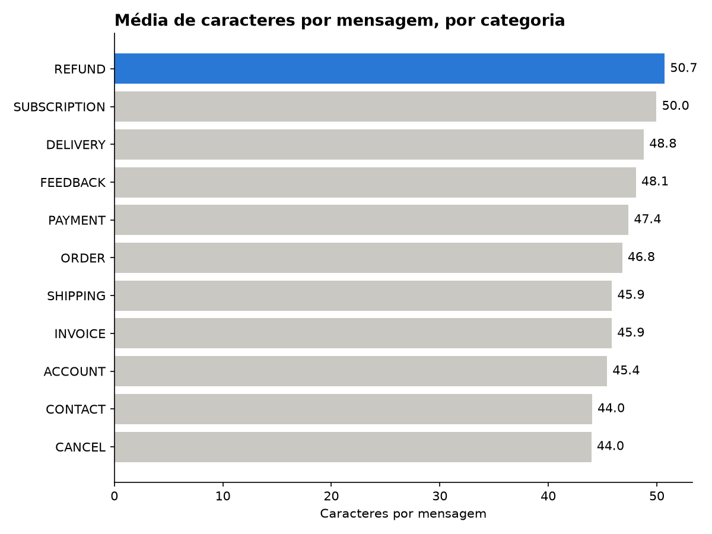

# Analisador de conversas de atendimento

> 🔨 Projeto em construção: atualizado a cada etapa.

Análise de mensagens de clientes de atendimento para entender **sobre o que os clientes falam e como escrevem**, com uso de um **LLM (Claude)** para classificar o sentimento e a urgência das mensagens e **comparação entre versões de prompt**.

## Dados

- **Dataset:** [Bitext Customer Support](https://huggingface.co/datasets/bitext/Bitext-customer-support-llm-chatbot-training-dataset) (Hugging Face)
- **Volume:** 26.872 mensagens, 11 categorias e 27 intenções
- Dados públicos, com informações pessoais substituídas por marcadores como `{{Delivery City}}`

## Principais achados

| Pergunta | Resultado |
| --- | --- |
| Os dados têm valores faltando? | Não: nenhuma coluna tem valores nulos |
| Qual o assunto mais frequente? | **ACCOUNT** (conta, login, cadastro): 5.986 mensagens, cerca de 22% do total |
| Como os clientes escrevem? | Mensagens curtas: **46,9 caracteres** e **8,7 palavras**, em média |
| Qual a mensagem mais curta? | **1 palavra**, o caso mais difícil para um bot interpretar |
| Qual categoria tem mensagens mais longas? | **Reembolso** (50,7 caracteres em média). As mais curtas são **cancelamento** e **contato** (44,0) |
| Quais intenções pedem mais texto? | **Prazo de entrega** (11,0 palavras) e **política de reembolso** (10,5) |
| Há mensagens repetidas? | Sim: 24.635 mensagens únicas em 26.872, com frases que aparecem até 8 vezes |



**Leitura dos resultados:** a diferença entre categorias é pequena (cerca de 7 caracteres entre a maior e a menor média), e a maior mensagem de cada categoria fica entre 15 e 16 palavras. Em todos os assuntos o cliente escreve pouco, então um agente de atendimento precisa entender a intenção com pouquíssimo contexto.

**Observação sobre os dados:** várias categorias e intenções têm quantidades redondas (1.000 ou 2.000 mensagens), o que indica um dataset montado de forma **balanceada** para treinar modelos, diferente de dados reais de atendimento.

## Validação com SQL

Os dados foram carregados em um banco **SQLite** e as análises refeitas com **SQL**. As consultas em SQL e em Pandas chegaram aos **mesmos resultados**, uma verificação cruzada que confirma os números.

Exemplo: as 5 intenções com mensagens mais longas ([`sql/consultas.sql`](sql/consultas.sql)).

## Classificação com LLM

Uma amostra aleatória de **200 mensagens** foi classificada pelo modelo **Claude Haiku 4.5** (API da Anthropic) em duas dimensões:

- **Sentimento:** positivo, neutro ou negativo
- **Urgência:** baixa, média ou alta

**Como funciona:**

- Um *system prompt* define o papel do modelo (analista de atendimento) e as regras de classificação.
- O modelo responde em **JSON padronizado**, convertido em colunas com Pandas.
- Tratamento de erros (`try/except`) garante que uma falha isolada não interrompa o processo.
- A amostra usa `random_state=42`, então as duas versões do prompt classificam **exatamente as mesmas mensagens**.
- A chave da API fica em um arquivo `.env`, fora do repositório.
- **Custo:** frações de centavo de dólar por mensagem.

## Engenharia de prompt: v1 x v2

### O problema do prompt v1

O primeiro prompt só listava as opções de resposta, sem explicar cada uma. A análise dos resultados mostrou dois problemas:

- **"Média" virou a resposta padrão:** 79,5% das mensagens foram classificadas com urgência média. Em categorias como cancelamento e envio, 100%.
- **Inconsistência:** a mesma mensagem recebeu classificações diferentes em execuções diferentes.

### O que mudou no prompt v2

- **Critérios explícitos** para cada nível. Exemplo: urgência alta = cliente impedido de fazer algo importante agora; baixa = dúvida ou consulta informativa.
- **Contexto** do negócio (e-commerce).
- Instrução direta para **não usar "média" como padrão**.
- **Exemplos resolvidos** (*few-shot*) mostrando o formato e o raciocínio esperados.

### Resultado

| Urgência | v1 | v2 |
| --- | --- | --- |
| Alta | 11,5% | 16,5% |
| Média | 79,5% | 30,5% |
| Baixa | 9,0% | 53,0% |

- A urgência mudou em **113 de 200** mensagens, e o sentimento em **23**.
- **87 mensagens migraram de média para baixa:** consultas como "ver a taxa de cancelamento", "baixar a fatura" e "política de reembolso". Pelo critério definido, são dúvidas informativas, e o v2 as classifica corretamente.
- O sentimento negativo caiu de **30,5% para 19,5%**, porque o critério passou a exigir reclamação, frustração ou problema relatado.

### Limitações encontradas

A revisão manual das 18 mensagens que subiram para urgência alta mostrou:

- **6 casos corretos:** problemas concretos, como não conseguir editar um pedido ou erro ao cadastrar endereço.
- **12 casos questionáveis:** simples pedidos para falar com um atendente. O critério de "alta" citava *"não consegue falar com alguém"*, e o modelo aplicou a regra ao pé da letra.
- **Sensibilidade à forma da frase:** "I try to notify of a sign-up error" foi classificada como alta, e "I don't know how to inform of problems with a signup" como baixa, apesar de tratarem do mesmo assunto.

**Aprendizado:** critérios claros mudam drasticamente o comportamento do modelo, mas **cada expressão do prompt é interpretada literalmente**. Por isso, toda mudança de prompt deve ser validada lendo uma amostra dos resultados, e não apenas olhando os números.

Resultados: [`resultados/classificacao_amostra.csv`](resultados/classificacao_amostra.csv) (v1) e [`resultados/classificacao_amostra_v2.csv`](resultados/classificacao_amostra_v2.csv) (v2).

## Etapas

- [x] Exploração inicial com Pandas (nulos, categorias, intenções, tamanho das mensagens)
- [x] Tamanho médio das mensagens por categoria e por intenção
- [x] Carga dos dados em banco SQLite e consultas SQL, validadas contra o Pandas
- [x] Visualizações
- [x] Classificação de sentimento e urgência com LLM (API do Claude) em amostra de 200 mensagens
- [x] Análise dos resultados e identificação de problemas no prompt v1
- [x] Prompt v2 com critérios e exemplos, e comparação v1 x v2
- [ ] Gráfico da comparação v1 x v2
- [ ] Conclusões finais

## Estrutura do projeto

| Arquivo | O que faz |
| --- | --- |
| `src/carregar.py` | Exploração dos dados com Pandas |
| `src/exercicios.py` | Análises por categoria e intenção com `groupby` |
| `src/banco.py` | Cria o banco SQLite com a tabela `conversas` |
| `src/consultas.py` | Executa as consultas do arquivo `.sql` no banco |
| `sql/consultas.sql` | Consultas SQL |
| `src/grafico.py` | Gera o gráfico de média de caracteres por categoria |
| `src/teste_api.py` | Primeiro teste de chamada à API do Claude |
| `src/classificar.py` | Classificação com o prompt v1 |
| `src/classificar_v2.py` | Classificação com o prompt v2 (critérios e exemplos) |
| `src/analise_llm.py` | Análise dos resultados: contagens, porcentagens e tabelas cruzadas |
| `src/comparar.py` | Comparação entre os resultados do v1 e do v2 |
| `resultados/classificacao_amostra.csv` | 200 mensagens classificadas pelo v1 |
| `resultados/classificacao_amostra_v2.csv` | As mesmas 200 mensagens classificadas pelo v2 |

## Tecnologias

Python · Pandas · SQL · SQLite · Matplotlib · API do Claude (Anthropic) · Engenharia de prompt · Git

## Como rodar

1. Clone o repositório e crie o ambiente virtual:

```
git clone https://github.com/Pedrofeliixx/analisador-conversas.git
cd analisador-conversas
python -m venv .venv
.venv\Scripts\activate
pip install -r requirements.txt
```

2. Baixe o CSV do dataset (link acima) e coloque na pasta `data/`.

3. Para a classificação com LLM, crie um arquivo `.env` na raiz do projeto com a sua chave da API da Anthropic (gerada em [platform.claude.com](https://platform.claude.com)):

```
ANTHROPIC_API_KEY=sua-chave
```

4. Rode as análises:

```
python src/carregar.py
python src/banco.py
python src/consultas.py
python src/grafico.py
python src/classificar.py
python src/classificar_v2.py
python src/analise_llm.py
python src/comparar.py
```